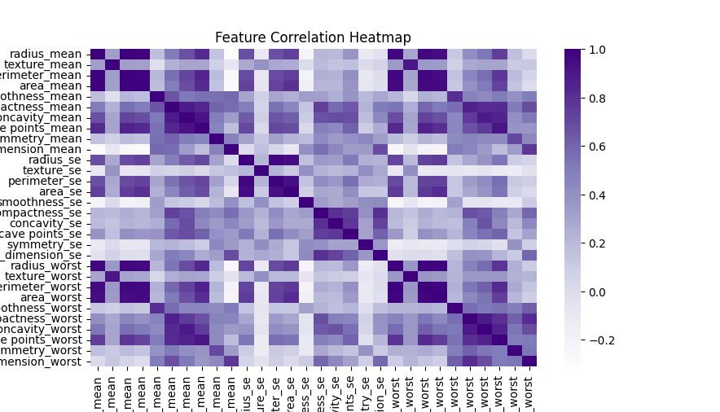
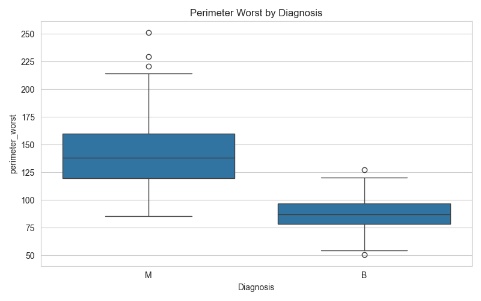
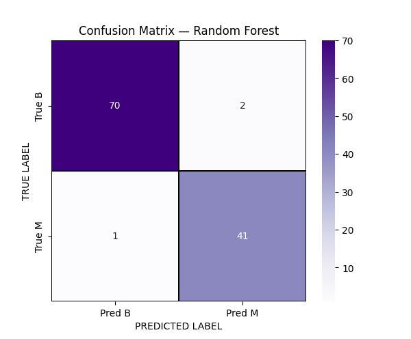
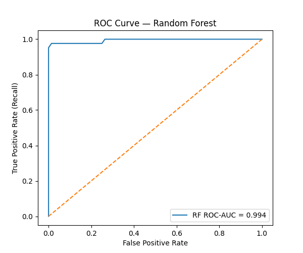
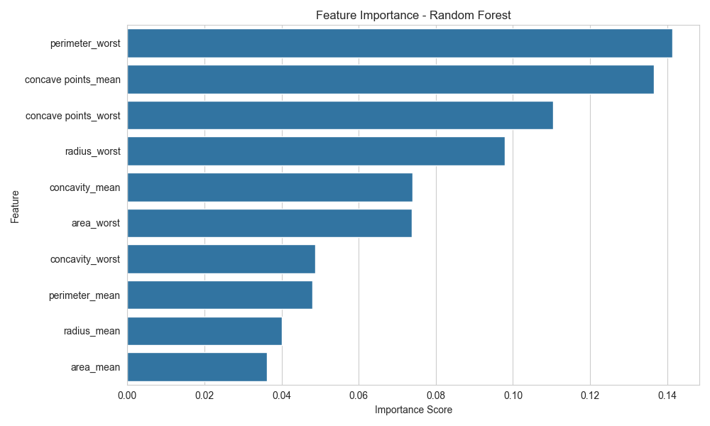

# Breast Cancer Diagnosis Prediction with Python: Decision Tree vs Random Forest

## Project Overview
This project uses the Breast Cancer Wisconsin dataset to predict whether a tumor is benign or malignant using machine learning. I compared a Decision Tree and a Random Forest model, with a strong focus on identifying malignant cases accurately.

## Business Problem
In a healthcare setting, missing a malignant tumor is more costly than incorrectly flagging a benign one. The goal of this project was to build a classification workflow that supports early risk detection and compare models based on their ability to identify high-risk cases.

## Dataset
The dataset contains breast cancer biopsy measurement features such as radius, perimeter, area, concavity, symmetry, and related statistics. The target variable is diagnosis:
- B = Benign
- M = Malignant

## Tools and Libraries
- Python
- Pandas
- NumPy
- Matplotlib
- Seaborn
- Scikit-learn
- Jupyter Notebook

## Project Workflow
1. Business understanding
2. Data loading and inspection
3. Data quality checks
4. Exploratory data analysis
5. Feature-target preparation
6. Train-test split with stratification
7. Feature scaling
8. Model training
9. Model evaluation
10. Business recommendation

## Exploratory Data Analysis
The analysis included:
- Diagnosis count distribution
- Feature correlation heatmap
- Boxplots for important features such as perimeter_worst, radius_worst, and area_worst
  ### Diagnosis Distribution
  .png)
  ### Feature Correlation Heatmap
  
  ### Perimeter Worst by Diagnosis
  
  
These visuals showed that some features clearly separate benign and malignant diagnoses.

## Modeling Approach
Two supervised machine learning models were built and compared:
- Decision Tree
- Random Forest

The workflow used:
- stratified train-test split
- feature scaling
- confusion matrix
- classification report
- ROC curve and ROC-AUC
- Precision-Recall curve and PR-AUC
- feature importance analysis

## Results Summary
The Random Forest model performed better than the Decision Tree and provided a stronger baseline for breast cancer diagnosis prediction.
### Main Takeaways
- The dataset had more benign than malignant cases
- Several features showed strong separation between the two classes
- Random Forest made fewer classification errors
- Random Forest achieved stronger ROC-AUC and PR-AUC
- Feature importance highlighted perimeter, concave points, radius, and area as major predictors
<table>
  <tr>
    <td width="50%" valign="top">

### Random Forest Confusion Matrix


  </td>
    <td width="50%" valign="top">

### Random Forest ROC Curve



  </td>
  </tr>
</table>

### Random Forest Feature Importance


## Business Recommendation
The Random Forest model is the stronger baseline model for this problem. However, this solution should be treated as a decision-support tool rather than a replacement for clinical diagnosis. Before real-world use, the model would need threshold tuning, cross-validation, explainability checks, and domain validation.

## Project Structure
```text
breast-cancer-diagnosis-ml/
├── data/
├── docs/
├── notebooks/
├── src/
├── video/
├── visuals/
├── .gitignore
├── LICENSE
├── README.md
└── requirements.txt
```
## How to Run the Project
1. Clone the repository
2. Install dependencies:

   ```bash
   pip install -r requirements.txt
   ```
3. Open the main Python script in `src/breast_cancer_analysis.py`

4. Review the visuals and model comparison results

## Video Walkthrough

A 5-minute project walkthrough video link will be added here soon.

For now, see the placeholder file here: [video_link.txt](video/video_link.txt)

## Author

**Raymond Royal Nyakabawu**  
MS in Business Analytics | Python | SQL | Machine Learning | Data Analytics
